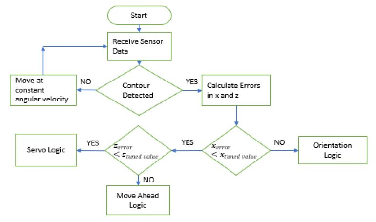
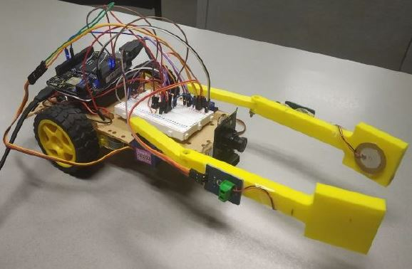

# Machine-Vision-based-Mobile-Gripper

The objective of this project is to build a mobile robot with a gripper that is able to detect and automatically grip an object with control algorithms based on machine vision and depth data feedback. This is conceptualized by having a gripper arm mounted on a robotic car which will be scanning the environment using a vision camera and IR sensor (X and Z coordinates) for object detection and gripping operation. The USB camera is trained to identify the presence of the object through its color and it gives us the x-coordinate of the object by contour detection algorithm using OpenCV. The vehicle spins around itself using the DC motors to detect the object and brings its presence to the field of view of the camera and stops when the center of the object is aligned with the center of the image. Once the robot is aligned, then the vehicle moves forward using DC motor actuation as close as possible to the object. If the object is moving, then the vehicle tries to maintain its distance to the object around 10 cm. The z distance is measured using an IR sensor. When the distance is 10 cm, the servo motors are then actuated for the gripping action and piezo electric sensors are used to ensure proper gripping of the object.

To achieve the objective as described above, we purchased a prebuilt robot starter kit (DC motors, wheels, chassis, caster wheel). Basic kit was then modified for the said objective. We have used Beagle bone Black as the microcontroller, a USB camera, IR sensor, and 2 piezoelectric sensors along with 2 DC motors and 2 Servo motors in the embedded system environment.

Component
Specifications
Beagle bone Black (Microcontroller) 512MB DDR3 RAM, 4GB 8-bit eMMC on-board flash storage, 3D graphics accelerator
USB camera Resolution: 640×400, Output speed: 30 frames per second
IR sensor Operating voltage range: DC 4.5-20V, output timing is from 0.5s to 200s
DC motors Operating voltage: 3V-6V DC, Maximum torque: 800g.cm (3V), Load current: 200mA (500mA max) (3V pm)
Servo motors Stall torque: 12kg/cm(6V), 13kg/cm (7.2V). Dimension: 40.7*19.7*42.9mm Controllable angle ranges from 0 to 180 degrees
AA batteries
1.5V supply
Motor Driver
Dual H-bridge
Piezoelectric sensor
Working Voltage: 3.3V or 5V, Size: 30mm x 23mm

Additionally, Dual H-bridge motor driver digital logic was implemented on a breadboard using L293d chip. In the logic, the PWM pins in the beagle bone black were connected to the driver inputs and the driver outputs were connected to the motors. The enable pins were always set HIGH. VCC2 was connected to the 6V power supply (4 AA batteries in series) and VCC1 was connected to the power pin in the microcontroller.

The robotic system consists of 4 actuators and 4 sensors as mentioned above. First type of actuator is the DC motor for the robot movement which are controlled using PWM pins from the microcontroller. Second type of actuator is the servo motor for the gripping action, they also are controlled using the PWM pins from the microcontroller.
The first type of sensor is the USB camera, which is able to provide vision feedback control to the robot (at 30 frames per second), the input from which is utilized for the lateral control of the robot. The second type of sensor is the IR sensor, that can read distance o the obstacle/object in front of the robot. The purpose of the sensor is to assist in the longitudinal control of the robot along with the USB camera. The third type of sensor is the piezo electric sensor, which measures the gripping force to indicate the gripping task being completed.
The system states are the x co-ordinate of the object in the image frame and the z co-ordinate which is the distance measurement from the object. X is measured using the object detection algorithm and the Z is measured using the depth data from the IR sensor. The control system consists of 2 feedback control loops and one open control loop. The first feedback loop is for the lateral (steering) control of the robot using the x-data from the image frame. The second feedback loop is for the longitudinal control of the robot using the distance measurements (z-data) from the IR sensor. The open loop system is for the gripping action using servo motors and the piezo electric sensors.

Object Detection using OpenCV:
Objects are visually detected by computers via several ways such as via its color, neural networks etc. For simplicity and considering computational resources, a colored object is used and detected, and its relative pixel position is noted with a USB - camera of resolution (640 x 640). The object color is pre-trained to be identified by the Computer Vision algorithm using OpenCV. The color is chosen to be orange. Several object detection algorithms are developed which are accurate but very computationally expensive such as the YOLO (You only look once) algorithm which is a trained neural network model capable of detecting multiple objects in a single-go. For simplicity, the object this time is tracked based on its color. The values or states from the picture are the object contour area and its center coordinate in x-direction. The x- coordinate should ideally be placed towards 320-pixel position (center). The PWM outputs to the motor control the yaw - direction and the control parameters are determined iteratively as the noise is very high for cheap sensors and the tracking algorithm based on color is never quite accurate.
Tracking Procedure:
● Images are captured by the USB camera. To process the images, portable microcontroller Beagle bone Black is used.
● The captured image is filtered using Gaussian Blur filter to smoothen the image and filter out the noise. RGB values of the image is converted to HSV as HSV is a better parameter than RGB in terms of intensity.
● Define the range for the color orange using an iterative procedure capturing images from camera.
● Create a mask of the image where the color is identified in the image (0 - no Orange, 1- Orange) and identify the corner points and get the contours
● There can be many contours in the field of view. The required contour will form a bigger contour compared to others because of the narrow color range.
● Areas of the contours are calculated, and a threshold value is chosen pragmatically. If the area of the contour is higher than the threshold, then we consider it else we ignore it.
● The robot starts at a position and tries to find the object while rotating on its own. A PI controller is used to get the robot near the object. Alternatively, an IR sensor is also used for obstacle detection and stop the robot from colliding with the environment.
● As the robot goes close to the object, the area of the contour increases and if it reaches a threshold, then we stop the robot and then grip it with gripper arms controlled by a servo motor.

IR Calibration:
IR sensors can be tricky to use because of their non-linear nature to measure the distance. For the calibration for distance measurement, the following relation was used,
Distance = 41.543 ∗ (volt+ 0.30221)−1.5281
Function IRread was written to read the voltage values from the IR sensors off the analog pins and moving average distance (calculated as above) data was returned.
Servo motor calibration:
Duty cycle for the servo motor actuation was tuned with the help of the data from the piezo electric sensor for improved gripping.

EXPERIMENTAL RESULTS
The noise in the IR data was attenuated as the moving average of the IR data was used in the control loop. In the camera data, to remove the excess noise, Gaussian Blur was used, which improved the performance of the system. Time delays were used wherever necessary and PWM outputs were tuned, which resulted in smoother operation of the system. The extensive calibration of the sensors was very crucial in giving the accurate results. The real-time digital feedback loops for the x and z direction control of the robot were quite accurate.

DISCUSSIONS AND CONCLUSIONS
After the tuning of the PWM outputs of the DC motors, duty cycles of the servo motors and the gains in the feedback control loops, the project objectives were accomplished. Apart from achieving the project objectives, we attempted to control the z-direction using the change in the contour area of the object detected, but as the area varies largely even with small changes in the contour, the control input generated is not very consistent. Also, in extension to the set objectives for the project, we also incorporated additional piezo electric sensors to have more consistent pressure applied while gripping so as to improve the gripping action.

